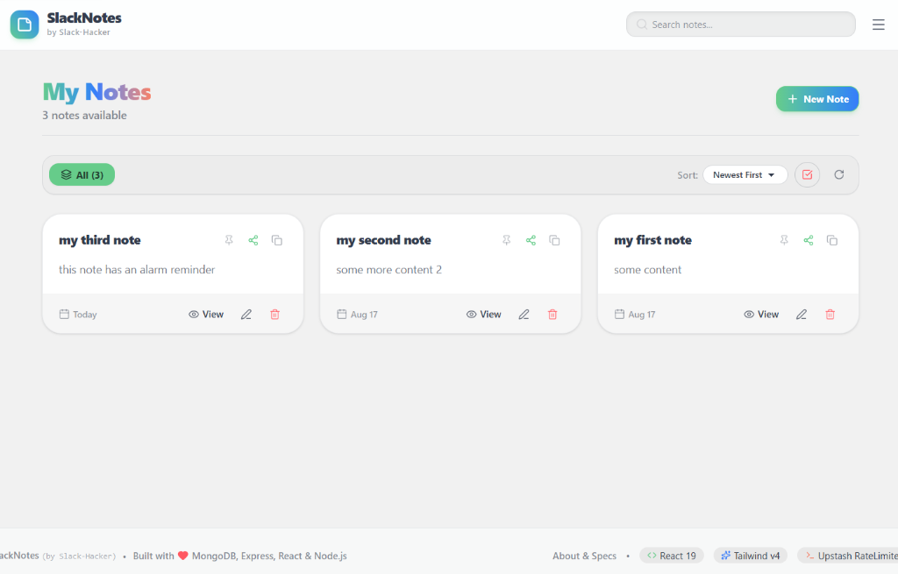

# SlackNotes (MERN Stack)

A modern full-stack note-taking web application built with **MongoDB, Express.js, React 19, and Node.js**, featuring Tailwind CSS v4, DaisyUI themes, real-time audio alarms, multi-note operations, and PDF/JPEG note exports.

Developed by **Slack-Hacker**.



---

## ✨ Features

- 📝 **Create, Edit & Delete Notes**: Rich note-taking interface with titles, formatted content, screenshot attachments, and pinning.
- 📌 **Pin & Filter Notes**: Pin important notes to top, filter by All, Pinned, Screenshots, or Alarms.
- ⏰ **Real-Time Alarms & Audio Chimes**: Set date/time reminders with background polling, desktop browser notifications, snooze, and chime sounds.
- 🎨 **Light & Dark Themes**: 8 curated visual themes with light and dark mode sections (`Light`, `Emerald`, `Cupcake`, `Corporate`, `Dark`, `Dracula`, `Synthwave`, `Sunset`).
- 🔍 **Real-Time Search**: Quick search filter by title or content (positioned adjacent to the top navigation menu).
- 📤 **PDF & JPEG Exporting**: Export single or multiple selected notes directly to `.pdf` documents or `.jpg` card images using client-side HTML5 Canvas rendering.
- 📦 **Bulk Select & Delete**: Multi-select mode for batch deleting or batch sharing notes.

---

## 🛠️ Technology Stack

- **Frontend**: React 19, Vite, Tailwind CSS v4, DaisyUI v5, Lucide Icons, React Hot Toast
- **Backend**: Node.js, Express.js, MongoDB (Mongoose), Upstash Rate Limiter middleware
- **Exporting**: Client-side HTML5 Canvas rendering engine for crisp PDF and JPEG note downloads

---

## 🚀 Getting Started

### Prerequisites

- Node.js (v18+ recommended)
- MongoDB Database URI (Local or MongoDB Atlas)

### Installation

1. **Clone the repository**:
   ```bash
   git clone https://github.com/Slack-Hacker/MERN_STACK.git
   cd MERN_STACK
   ```

2. **Setup Backend**:
   ```bash
   cd backend
   npm install
   ```
   Create `.env` file in `backend/`:
   ```env
   PORT=5000
   MONGO_URI=your_mongodb_connection_string
   ```
   Start backend server:
   ```bash
   npm run dev
   ```

3. **Setup Frontend**:
   ```bash
   cd ../frontend
   npm install
   npm run dev
   ```

---

## 📄 License

MIT License
